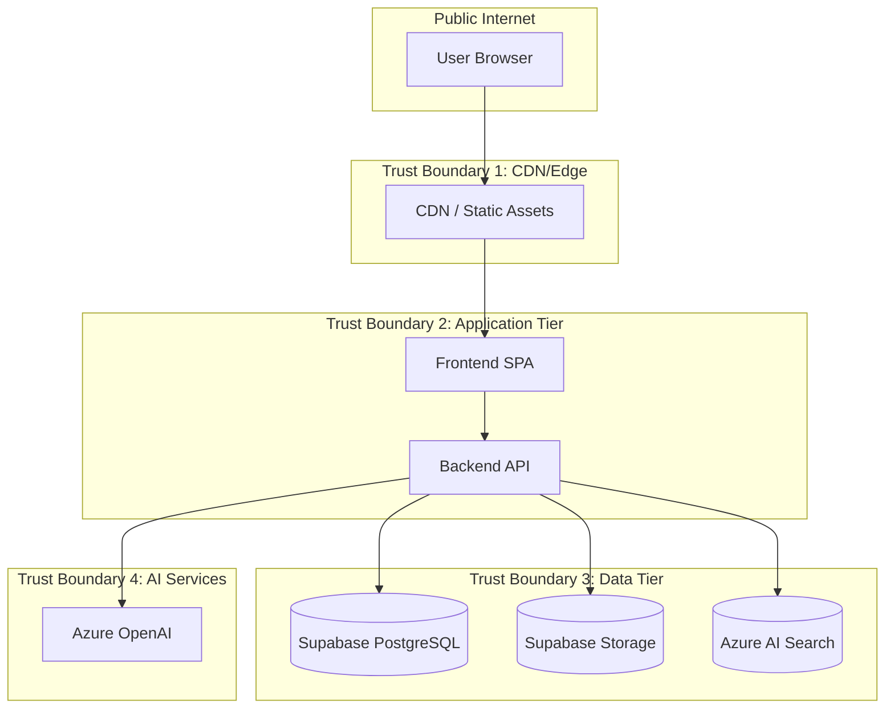
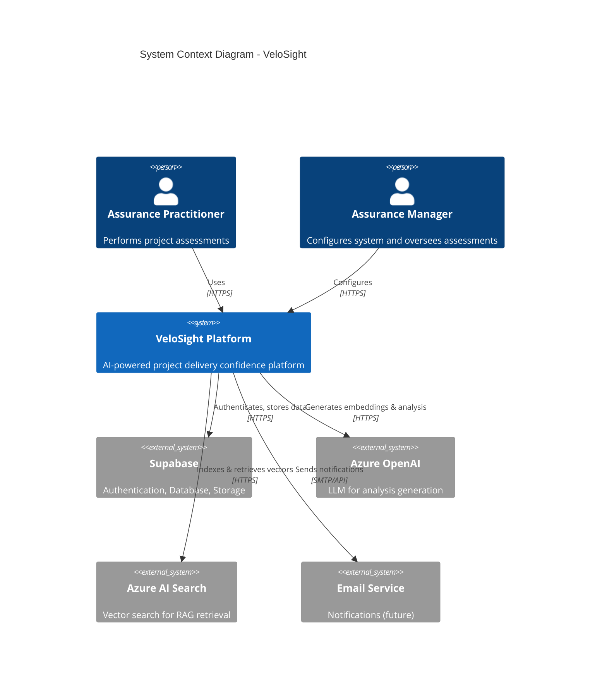
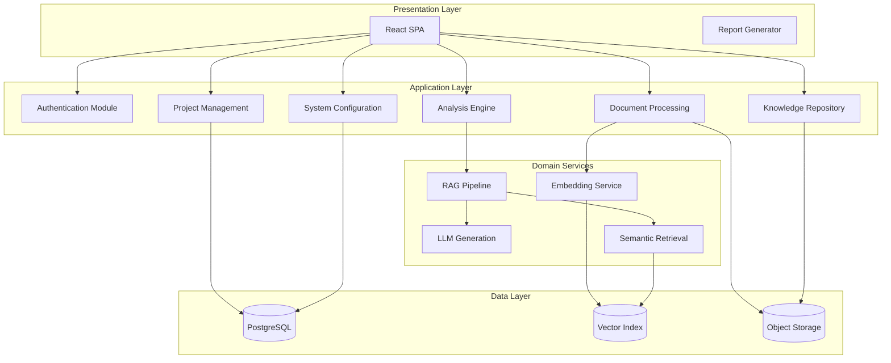
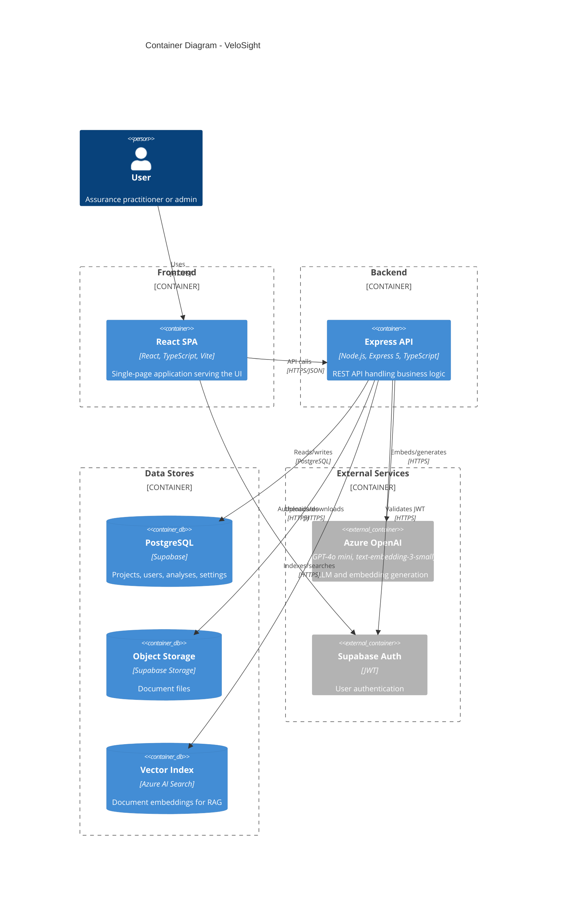
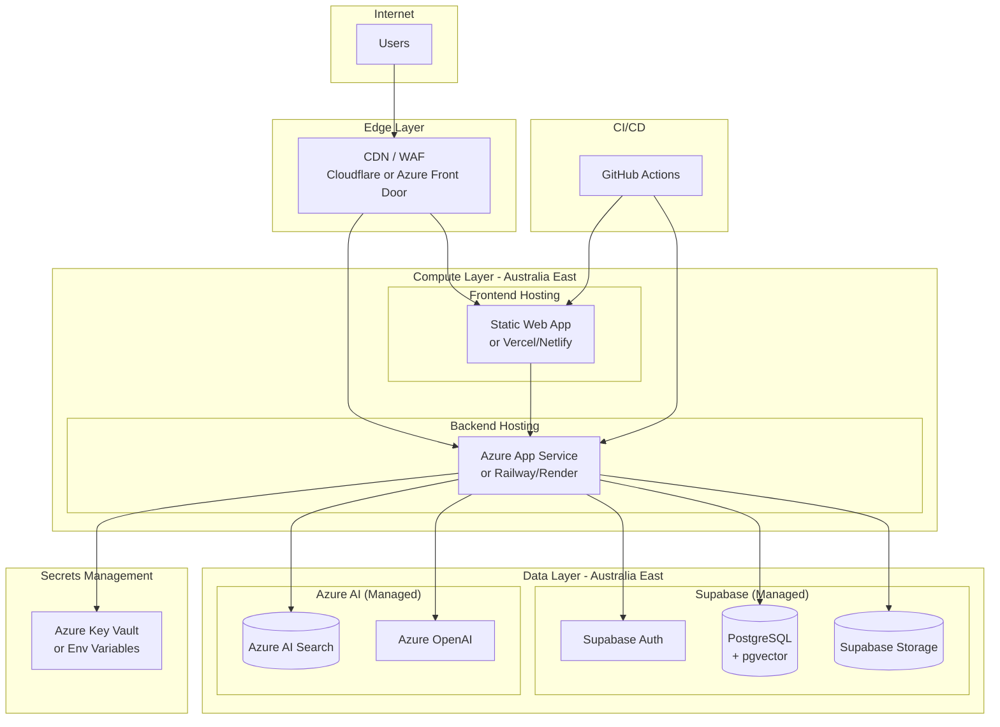
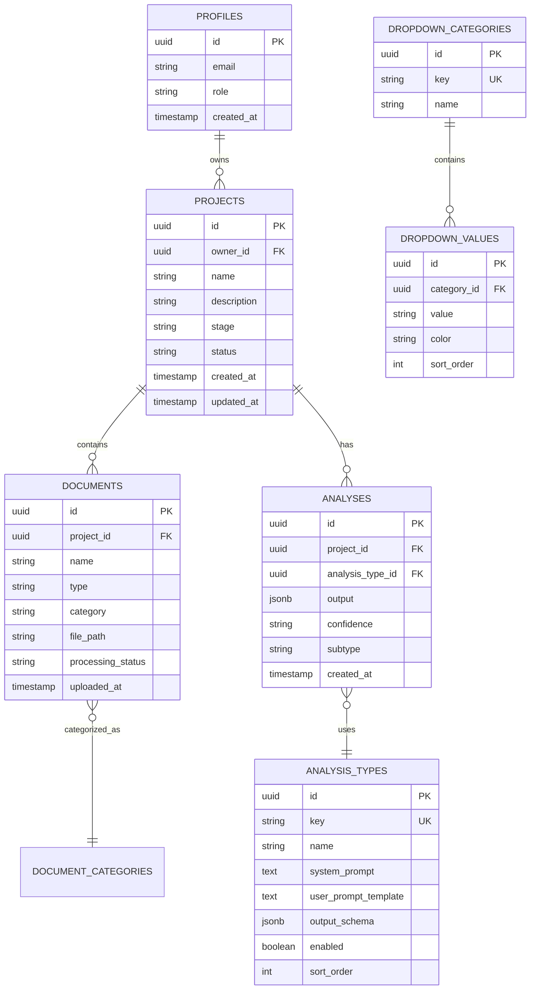
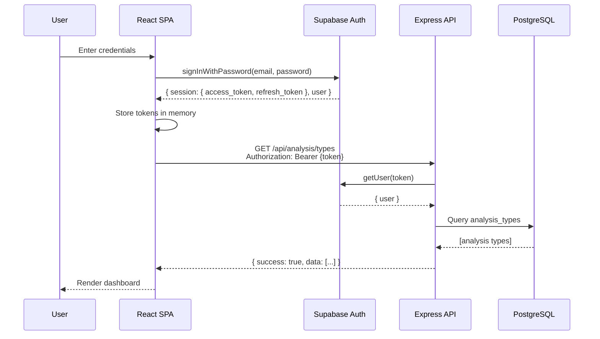
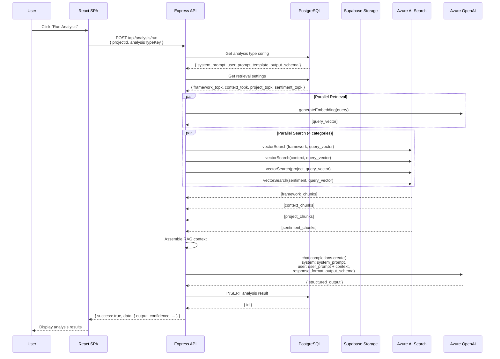
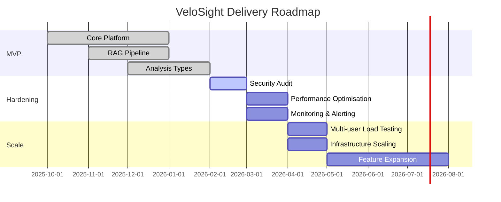

# VeloSight Solution Architecture Document

**Version:** 1.0
**Date:** February 2026
**Status:** Draft
**Owner:** VeloSight Architecture Team

---

## Table of Contents

1. [Executive Summary](#1-executive-summary)
2. [Architecture Drivers](#2-architecture-drivers)
3. [Requirements](#3-requirements)
4. [Stakeholders & Personas](#4-stakeholders--personas)
5. [Context & Scope](#5-context--scope)
6. [Target Architecture](#6-target-architecture)
7. [Component Design](#7-component-design)
8. [Security Architecture](#8-security-architecture)
9. [Integration Architecture](#9-integration-architecture)
10. [Resilience & Performance](#10-resilience--performance)
11. [Observability & Operations](#11-observability--operations)
12. [DevOps & Environments](#12-devops--environments)
13. [Architecture Decisions](#13-architecture-decisions)
14. [Risks & Mitigations](#14-risks--mitigations)
15. [Delivery Roadmap](#15-delivery-roadmap)
16. [Appendices](#16-appendices)

---

## 1. Executive Summary

### 1.1 Problem Statement

Project delivery assurance practitioners lack an integrated platform to systematically assess project health, identify risks, and generate evidence-based insights. Current approaches rely on manual document review, fragmented tooling, and subjective assessments, leading to:

- Inconsistent analysis quality across practitioners
- Time-consuming document synthesis
- Lack of traceability between evidence and conclusions
- Limited ability to leverage organisational best practices at scale

### 1.2 Desired Outcomes

| Outcome | Success Metric |
|---------|----------------|
| Accelerated project assessments | 60% reduction in time to complete delivery confidence reviews |
| Consistent analysis quality | Standardised output schemas with traceable evidence citations |
| Knowledge leverage | RAG-powered insights drawing from organisational frameworks |
| Actionable recommendations | Structured risk registers, confidence ratings, and improvement hypotheses |
| Audit trail | Complete history of analyses with version control |

### 1.3 Scope

**In Scope:**
- Project creation and lifecycle management
- Document upload, processing, and vectorization (PDF, DOCX, XLSX, PPTX, TXT)
- AI-powered analysis with configurable prompts and output schemas
- Four analysis types: Delivery Confidence, Risk Assessment, Gateway Review, Hypothesis Generation
- Knowledge repository for assurance frameworks and best practices
- Report generation and export (DOCX)
- Role-based access control (Admin, User)
- Configurable dropdown categories with colour-coded badges

**Out of Scope (v1.0):**
- Real-time collaboration features
- Mobile native applications
- Offline mode
- Integration with project management tools (Jira, Azure DevOps)
- Custom LLM fine-tuning
- Multi-tenancy across organisations

---

## 2. Architecture Drivers

### 2.1 Business Goals

| ID | Goal | Priority |
|----|------|----------|
| BG-1 | Enable practitioners to perform structured project assessments using AI | P0 |
| BG-2 | Centralise organisational assurance knowledge for reuse | P0 |
| BG-3 | Provide auditable, traceable analysis outputs | P1 |
| BG-4 | Reduce manual effort in document synthesis | P1 |
| BG-5 | Support multiple analysis frameworks (Gateway, Risk, Confidence) | P1 |

### 2.2 Key Constraints

| Constraint | Description | Impact |
|------------|-------------|--------|
| C-1 | Must use Azure OpenAI (not OpenAI direct) for data residency | Limits LLM provider options |
| C-2 | Supabase as primary database/auth platform | Architecture must align with PostgreSQL + Supabase Auth |
| C-3 | Small team (1-3 developers) | Favour managed services, avoid operational complexity |
| C-4 | Australian data residency preferred | Deploy to AU-East Azure region |
| C-5 | Budget-conscious startup | Minimise fixed infrastructure costs, use consumption-based services |

### 2.3 Assumptions

| ID | Assumption | Risk if Invalid |
|----|------------|-----------------|
| A-1 | Users have stable internet connectivity | Offline mode would be required |
| A-2 | Document volumes < 1000 per project | May need pagination/archival strategy |
| A-3 | Concurrent users < 50 in initial deployment | May need horizontal scaling sooner |
| A-4 | Azure OpenAI quotas sufficient for workload | May need quota increases or batching |
| A-5 | English-language documents only | Multi-language would require additional embedding models |

### 2.4 Quality Attributes (NFRs)

| Attribute | Priority | Requirement |
|-----------|----------|-------------|
| **Security** | P0 | All data encrypted in transit (TLS 1.3) and at rest; JWT-based authentication; RLS on all tables |
| **Availability** | P1 | 99.5% uptime during business hours (AU timezone) |
| **Performance** | P1 | Page load < 2s; Analysis completion < 60s for typical document sets |
| **Usability** | P1 | Responsive design; WCAG 2.1 AA accessibility |
| **Maintainability** | P1 | Modular codebase; TypeScript throughout; comprehensive logging |
| **Scalability** | P2 | Support 10x user growth without architecture changes |
| **Observability** | P2 | Structured logging; error tracking; performance metrics |

---

## 3. Requirements

### 3.1 Functional Requirements

| ID | Requirement | Priority | Status |
|----|-------------|----------|--------|
| FR-1 | Users can create, update, archive projects | P0 | Implemented |
| FR-2 | Users can upload documents (PDF, DOCX, XLSX, PPTX, TXT) up to 10MB | P0 | Implemented |
| FR-3 | System extracts text and generates embeddings for uploaded documents | P0 | Implemented |
| FR-4 | Users can run AI-powered analyses on project documents | P0 | Implemented |
| FR-5 | System retrieves relevant context using semantic search (RAG) | P0 | Implemented |
| FR-6 | Admins can configure analysis prompts and output schemas | P0 | Implemented |
| FR-7 | Users can view analysis history and results | P0 | Implemented |
| FR-8 | Users can export analysis results as DOCX reports | P1 | Implemented |
| FR-9 | Admins can manage dropdown categories and values | P1 | Implemented |
| FR-10 | System supports knowledge repository for framework materials | P1 | Implemented |
| FR-11 | Users can filter and search projects | P1 | Implemented |
| FR-12 | Admins can manage user accounts and roles | P2 | Implemented |
| FR-13 | System tracks document processing status | P2 | Implemented |

### 3.2 Non-Functional Requirements

| Attribute | Metric | Target | Measurement Method |
|-----------|--------|--------|-------------------|
| Availability | Uptime % | ≥ 99.5% (business hours) | Synthetic monitoring |
| Latency (P95) | Page load | < 2,000 ms | Real User Monitoring |
| Latency (P95) | API response | < 500 ms (excl. LLM calls) | APM tracing |
| Latency (P95) | Analysis completion | < 60,000 ms | Backend metrics |
| Security | Authentication | JWT with < 1hr expiry | Supabase Auth config |
| Security | Data encryption | TLS 1.3 in transit, AES-256 at rest | Compliance audit |
| Privacy | Data residency | Australia (AU-East) | Deployment verification |
| Scalability | Concurrent users | 50 (baseline), 500 (peak) | Load testing |
| Scalability | Documents per project | 1,000 max | Application validation |
| Maintainability | Code coverage | ≥ 70% | CI pipeline |
| Maintainability | TypeScript strict mode | Enabled | tsconfig.json |
| Observability | Log retention | 30 days | Log aggregation config |
| Observability | Error tracking | 100% of unhandled exceptions | Error monitoring tool |
| Accessibility | WCAG compliance | Level AA | Automated + manual audit |

---

## 4. Stakeholders & Personas

### 4.1 Stakeholder Matrix

| Stakeholder | Role | Interest | Influence |
|-------------|------|----------|-----------|
| Assurance Practitioners | Primary Users | High | Medium |
| Assurance Managers | Decision Makers | High | High |
| IT Operations | Support & Hosting | Medium | Medium |
| Compliance/Audit | Governance | Medium | High |
| Product Owner | Direction & Prioritisation | High | High |
| Development Team | Build & Maintain | High | Medium |

### 4.2 User Personas

#### Persona 1: Assurance Practitioner (User)

| Attribute | Description |
|-----------|-------------|
| **Role** | Project Delivery Assurance Analyst |
| **Goals** | Quickly assess project health; Generate evidence-based reports |
| **Tasks** | Upload documents, run analyses, review results, export reports |
| **Access Needs** | Read/write own projects; Read knowledge repository |
| **Trust Level** | Authenticated user with project-scoped access |

#### Persona 2: Assurance Manager (Admin)

| Attribute | Description |
|-----------|-------------|
| **Role** | Head of Delivery Assurance |
| **Goals** | Standardise analysis frameworks; Oversee practitioner outputs |
| **Tasks** | Configure analysis parameters, manage categories, review all projects |
| **Access Needs** | Full read/write across all projects and settings |
| **Trust Level** | Elevated privileges; Can modify system configuration |

### 4.3 Trust Boundaries



---

## 5. Context & Scope

### 5.1 System Context Diagram



### 5.2 Scope Boundaries

| Category | In Scope | Out of Scope |
|----------|----------|--------------|
| **Users** | Authenticated practitioners and admins | Anonymous users, external stakeholders |
| **Documents** | PDF, DOCX, DOC, XLSX, XLS, PPTX, TXT | Images, video, audio, CAD files |
| **Analysis** | Delivery Confidence, Risk, Gateway, Hypothesis | Custom ML models, predictive analytics |
| **Integration** | Azure OpenAI, Azure AI Search, Supabase | Jira, Azure DevOps, Slack, Teams |
| **Deployment** | Single-tenant cloud deployment | Multi-tenant SaaS, on-premises |
| **Geography** | Australia | Multi-region deployment |

---

## 6. Target Architecture

### 6.1 Logical Architecture



### 6.2 Container Diagram



### 6.3 Deployment Architecture



---

## 7. Component Design

### 7.1 Frontend Approach

| Aspect | Decision | Rationale |
|--------|----------|-----------|
| **Rendering** | Single-Page Application (SPA) | Simpler deployment; Rich interactivity; Suitable for authenticated app |
| **Framework** | React 18 with TypeScript | Team expertise; Strong ecosystem; Type safety |
| **Build Tool** | Vite | Fast HMR; Modern ESM support |
| **Routing** | React Router v6 | Standard SPA routing; Nested routes support |
| **State Management** | React Query (server state) + React Context (UI state) | Separation of concerns; Built-in caching/revalidation |
| **Design System** | shadcn/ui (Radix primitives) + Tailwind CSS | Accessible components; Customisable; Low bundle size |
| **Forms** | React Hook Form + Zod | Performant; Type-safe validation |

**Key Frontend Modules:**

| Module | Path | Responsibility |
|--------|------|----------------|
| Dashboard | `/` | Overview, quick actions, recent projects |
| Projects | `/projects`, `/projects/:id` | Project CRUD, document management |
| Analysis | `/projects/:id/insights` | Run analyses, view history |
| Reports | `/reports/:type/:id` | View and export analysis reports |
| Knowledge | `/knowledge` | Framework materials management |
| Settings | `/settings` | Categories, analysis parameters, users |

### 7.2 Backend Approach

| Aspect | Decision | Rationale |
|--------|----------|-----------|
| **Architecture** | Modular Monolith | Simple deployment; Sufficient for current scale; Clear module boundaries |
| **Runtime** | Node.js 18+ with TypeScript | Shared language with frontend; Async I/O for external API calls |
| **Framework** | Express 5 | Mature; Middleware ecosystem; Simple mental model |
| **Module Structure** | Routes → Services → Data Access | Layered architecture; Testable; Replaceable components |

**Backend Module Structure:**

```
server/src/
├── index.ts              # Entry point, middleware setup
├── middleware/
│   └── auth.ts           # JWT validation middleware
├── routes/
│   ├── analysis.ts       # /api/analysis endpoints
│   ├── documents.ts      # /api/documents endpoints
│   └── search.ts         # /api/search endpoints
├── services/
│   ├── azure-openai.ts   # Azure OpenAI client
│   ├── azure-search.ts   # Azure AI Search client
│   ├── generation.ts     # LLM generation pipeline
│   ├── processing.ts     # Document processing
│   └── retrieval.ts      # RAG retrieval
└── utils/
    └── odata.ts          # OData filter utilities
```

### 7.3 API Design

| Aspect | Decision | Details |
|--------|----------|---------|
| **Style** | REST | Resource-oriented; Familiar; Tooling support |
| **Format** | JSON | Standard; Native JavaScript support |
| **Versioning** | URL path (`/api/v1/`) | Explicit; Easy to deprecate (not yet implemented) |
| **Authentication** | Bearer JWT | Supabase Auth tokens |
| **Error Model** | `{ success: boolean, error?: string, data?: T }` | Consistent response envelope |

**Core Endpoints:**

| Method | Endpoint | Description |
|--------|----------|-------------|
| GET | `/api/analysis/types` | List enabled analysis types |
| GET | `/api/analysis/types/:key` | Get analysis type details |
| PUT | `/api/analysis/types/:id` | Update analysis parameters (admin) |
| POST | `/api/analysis/run` | Execute analysis on project |
| GET | `/api/analysis/settings/retrieval` | Get RAG retrieval settings |
| PUT | `/api/analysis/settings/retrieval` | Update retrieval settings |
| POST | `/api/documents/project/upload` | Process project document |
| DELETE | `/api/documents/project/delete` | Remove document and vectors |
| POST | `/api/documents/framework/upload` | Process framework material |
| DELETE | `/api/documents/framework/delete` | Remove framework material |

**Error Handling:**

```typescript
// Standard error response
{
  success: false,
  error: "Human-readable error message"
}

// HTTP status codes
// 400 - Validation errors
// 401 - Authentication required
// 403 - Insufficient permissions
// 404 - Resource not found
// 500 - Server error
```

### 7.4 Data Model Overview



### 7.5 Caching Strategy

| Layer | Strategy | TTL | Invalidation |
|-------|----------|-----|--------------|
| **CDN** | Static assets (JS, CSS, images) | 1 year (versioned filenames) | Deploy new version |
| **API (React Query)** | Project list, dropdown values | 5 minutes | Manual invalidation on mutation |
| **API (React Query)** | Analysis history | 1 minute | Invalidate on new analysis |
| **Backend** | Azure OpenAI client | Connection pooling | N/A |
| **Backend** | Supabase client | Singleton | N/A |

### 7.6 File/Object Storage Strategy

| Bucket | Content | Access | Retention |
|--------|---------|--------|-----------|
| `documents` | Project documents (PDF, DOCX, etc.) | Authenticated users (RLS) | Indefinite (project lifecycle) |
| `materials` | Framework/knowledge materials | Authenticated users (RLS) | Indefinite |

**File Processing Pipeline:**

1. Frontend uploads file to Supabase Storage
2. Frontend calls backend with file metadata
3. Backend downloads file from storage
4. Backend extracts text (pdf-parse, mammoth, xlsx)
5. Backend chunks text (semantic chunking)
6. Backend generates embeddings (Azure OpenAI)
7. Backend indexes chunks in Azure AI Search
8. Backend updates document status in PostgreSQL

---

## 8. Security Architecture

### 8.1 Authentication & Authorization

| Aspect | Implementation |
|--------|----------------|
| **Identity Provider** | Supabase Auth (email/password) |
| **Token Type** | JWT (RS256) |
| **Token Lifetime** | 1 hour (access), 7 days (refresh) |
| **Authorization Model** | RBAC (Admin, User roles) |
| **Data Authorization** | Row Level Security (RLS) on PostgreSQL |

**Role Permissions:**

| Permission | User | Admin |
|------------|------|-------|
| View own projects | ✓ | ✓ |
| Create/edit own projects | ✓ | ✓ |
| View all projects | ✗ | ✓ |
| Run analyses | ✓ | ✓ |
| Configure analysis parameters | ✗ | ✓ |
| Manage dropdown categories | ✗ | ✓ |
| Manage users | ✗ | ✓ |
| Upload framework materials | ✗ | ✓ |

### 8.2 Threat Model Summary

| Threat | STRIDE Category | Likelihood | Impact | Mitigation |
|--------|-----------------|------------|--------|------------|
| JWT token theft | Spoofing | Medium | High | Short expiry; HTTPS only; HttpOnly cookies for refresh |
| SQL injection | Tampering | Low | Critical | Parameterised queries; Supabase client |
| OData filter injection | Tampering | Medium | High | Parameterised OData utilities (`server/src/utils/odata.ts`) |
| XSS attacks | Tampering | Medium | High | React auto-escaping; CSP headers |
| Unauthorized data access | Information Disclosure | Medium | High | RLS policies; JWT validation on all endpoints |
| LLM prompt injection | Tampering | Medium | Medium | System prompts separate from user content; Output validation |
| Denial of service | Denial of Service | Medium | Medium | Rate limiting; File size limits |
| Privilege escalation | Elevation of Privilege | Low | Critical | Role checks in middleware; RLS policies |

### 8.3 Data Protection

| Data State | Protection | Implementation |
|------------|------------|----------------|
| **In Transit** | TLS 1.3 | CDN/load balancer termination; Backend HTTPS |
| **At Rest (DB)** | AES-256 | Supabase managed encryption |
| **At Rest (Storage)** | AES-256 | Supabase Storage encryption |
| **At Rest (Search)** | Microsoft-managed keys | Azure AI Search encryption |
| **Backups** | Encrypted | Supabase PITR with encryption |

### 8.4 Secrets Management

| Secret | Storage | Rotation Policy |
|--------|---------|-----------------|
| Supabase Service Role Key | Environment variable / Key Vault | Annual |
| Azure OpenAI API Key | Environment variable / Key Vault | Annual |
| Azure AI Search Admin Key | Environment variable / Key Vault | Annual |
| JWT Signing Key | Supabase managed | Managed by Supabase |

### 8.5 Secure SDLC Controls

| Control | Tool | Stage |
|---------|------|-------|
| Dependency scanning | Dependabot / npm audit | CI + Weekly |
| SAST | ESLint security rules | CI |
| Secret detection | Git hooks / GitHub secret scanning | Pre-commit + CI |
| Container scanning | (If containerised) Trivy | CI |
| Penetration testing | Manual | Pre-production (annually) |

### 8.6 Audit Logging

| Event | Data Captured | Retention |
|-------|---------------|-----------|
| User login | User ID, IP, timestamp, success/failure | 90 days |
| Analysis run | User ID, project ID, analysis type, timestamp | Indefinite |
| Document upload | User ID, document ID, project ID, timestamp | Indefinite |
| Settings change | User ID, setting key, old/new value, timestamp | 90 days |
| Admin actions | User ID, action type, target, timestamp | 90 days |

---

## 9. Integration Architecture

### 9.1 External Systems

| System | Provider | Purpose | Data Exchanged |
|--------|----------|---------|----------------|
| Supabase Auth | Supabase | User authentication | JWT tokens, user profiles |
| Supabase Database | Supabase | Primary data store | Projects, analyses, settings |
| Supabase Storage | Supabase | Document storage | File uploads/downloads |
| Azure OpenAI | Microsoft | LLM & embeddings | Text prompts, completions, vectors |
| Azure AI Search | Microsoft | Vector search | Document chunks, embeddings, queries |

### 9.2 Interface Contracts

| System | Protocol | Auth | Data Format | Frequency | Failure Handling |
|--------|----------|------|-------------|-----------|------------------|
| Supabase Auth | HTTPS REST | API Key + JWT | JSON | Per request | Retry with backoff; Fallback to cached session |
| Supabase DB | PostgreSQL | Connection string | SQL/JSON | Per request | Connection pool; Retry |
| Supabase Storage | HTTPS REST | JWT | Binary/JSON | Per upload | Retry with backoff |
| Azure OpenAI | HTTPS REST | API Key | JSON | Per analysis | Retry (3x); Circuit breaker; User notification |
| Azure AI Search | HTTPS REST | API Key | JSON/OData | Per query | Retry (3x); Graceful degradation |

### 9.3 Sequence Diagrams

#### 9.3.1 User Authentication Flow



#### 9.3.2 Document Analysis Flow



---

## 10. Resilience & Performance

### 10.1 Availability Design

| Component | Availability Strategy | RTO | RPO |
|-----------|----------------------|-----|-----|
| Frontend (SPA) | CDN with multiple PoPs | < 5 min | N/A (stateless) |
| Backend API | Single instance (MVP); Auto-restart | < 5 min | N/A (stateless) |
| Database | Supabase managed (multi-AZ) | < 1 hour | < 1 hour (PITR) |
| Storage | Supabase managed (replicated) | < 1 hour | 0 (synchronous) |
| Azure AI Search | Azure managed (replicated) | < 1 hour | < 1 hour |
| Azure OpenAI | Azure managed | N/A | N/A |

**Graceful Degradation:**

| Failure | Degraded Behaviour |
|---------|-------------------|
| Azure OpenAI unavailable | Display error; Allow document viewing; Queue analysis for retry |
| Azure AI Search unavailable | Display error; Allow project management; Disable analysis |
| Database unavailable | Application unavailable (critical dependency) |

### 10.2 Retry & Circuit Breaker Policy

| Service | Retry Count | Backoff | Circuit Breaker |
|---------|-------------|---------|-----------------|
| Azure OpenAI | 3 | Exponential (1s, 2s, 4s) | Open after 5 failures in 1 min |
| Azure AI Search | 3 | Exponential (500ms, 1s, 2s) | Open after 5 failures in 1 min |
| Supabase | 3 | Exponential (500ms, 1s, 2s) | N/A (critical path) |

### 10.3 Rate Limiting

| Endpoint Category | Limit | Window | Action on Exceed |
|-------------------|-------|--------|------------------|
| API (authenticated) | 100 requests | 1 minute | 429 Too Many Requests |
| Analysis runs | 10 requests | 1 minute | 429 + Queue message |
| Document uploads | 20 requests | 1 minute | 429 |
| Login attempts | 5 attempts | 5 minutes | 429 + Lockout |

### 10.4 Capacity Model

| Resource | Baseline (50 users) | Peak (500 users) | Scaling Approach |
|----------|---------------------|------------------|------------------|
| Frontend | Static hosting (unlimited) | CDN scales | N/A |
| Backend | 1 instance (2 vCPU, 4GB) | 4 instances | Horizontal (load balanced) |
| Database | Supabase Free/Pro | Supabase Pro | Vertical (Supabase plans) |
| Azure OpenAI | 120K TPM quota | 500K TPM quota | Quota increase request |
| Azure AI Search | Basic tier | Standard tier | Tier upgrade |

---

## 11. Observability & Operations

### 11.1 Logging Strategy

| Layer | Tool | Log Level | Format |
|-------|------|-----------|--------|
| Frontend | Console + Error boundary | Error, Warn | JSON (structured) |
| Backend | Console (stdout) | Info, Warn, Error | JSON (structured) |
| Database | Supabase logs | Query, Error | Supabase dashboard |

**Log Fields:**

```json
{
  "timestamp": "2026-02-08T10:30:00Z",
  "level": "info",
  "service": "velosight-api",
  "traceId": "abc123",
  "userId": "user-uuid",
  "action": "analysis.run",
  "projectId": "project-uuid",
  "analysisType": "delivery-confidence",
  "durationMs": 45000,
  "status": "success"
}
```

### 11.2 Metrics Strategy

| Metric | Type | Source | Alert Threshold |
|--------|------|--------|-----------------|
| Request rate | Counter | API middleware | N/A (informational) |
| Request latency (P95) | Histogram | API middleware | > 5s |
| Error rate | Counter | API middleware | > 5% over 5 min |
| Analysis duration | Histogram | Analysis service | > 120s |
| Active users | Gauge | Auth events | N/A |
| Document processing queue | Gauge | Processing service | > 100 pending |

### 11.3 SLO/SLI Suggestions

| SLO | SLI | Target | Measurement |
|-----|-----|--------|-------------|
| Availability | Successful requests / Total requests | 99.5% | Synthetic monitoring |
| Latency | P95 API response time | < 500ms (excl. LLM) | APM |
| Analysis Success | Successful analyses / Total attempts | 95% | Application metrics |
| Error Rate | 5xx responses / Total responses | < 1% | API logs |

### 11.4 Runbooks

| # | Runbook | Trigger | Actions |
|---|---------|---------|---------|
| 1 | **API Unresponsive** | Health check fails | 1. Check App Service status<br/>2. Review error logs<br/>3. Restart service<br/>4. Check dependencies |
| 2 | **High Error Rate** | Error rate > 5% | 1. Identify error pattern in logs<br/>2. Check external dependencies<br/>3. Roll back if recent deploy |
| 3 | **Azure OpenAI Quota Exceeded** | 429 errors from OpenAI | 1. Check quota usage<br/>2. Request quota increase<br/>3. Implement request queuing |
| 4 | **Database Connection Issues** | Connection timeouts | 1. Check Supabase status<br/>2. Verify connection pooling<br/>3. Check for long-running queries |
| 5 | **Document Processing Stuck** | Documents in "processing" > 1 hour | 1. Check processing logs<br/>2. Verify Azure services<br/>3. Manually retry or mark failed |

### 11.5 Backup & Disaster Recovery

| Component | Backup Method | Frequency | Retention | RTO | RPO |
|-----------|---------------|-----------|-----------|-----|-----|
| Database | Supabase PITR | Continuous | 7 days | 1 hour | 5 min |
| Storage | Supabase replication | Continuous | N/A | 1 hour | 0 |
| Vector Index | Re-index from source | On-demand | N/A | 4 hours | 0 (rebuild) |
| Configuration | Git repository | On commit | Indefinite | 15 min | 0 |

---

## 12. DevOps & Environments

### 12.1 CI/CD Pipeline

```mermaid
graph LR
    subgraph "Source"
        Git[GitHub Repository]
    end

    subgraph "CI Pipeline"
        Lint[Lint & Format]
        TypeCheck[TypeScript Check]
        Test[Unit Tests]
        Build[Build]
        Scan[Security Scan]
    end

    subgraph "CD Pipeline"
        DeployDev[Deploy to Dev]
        DeployStage[Deploy to Staging]
        DeployProd[Deploy to Production]
    end

    Git --> Lint
    Lint --> TypeCheck
    TypeCheck --> Test
    Test --> Build
    Build --> Scan
    Scan --> DeployDev
    DeployDev -->|Manual approval| DeployStage
    DeployStage -->|Manual approval| DeployProd
```



**Pipeline Stages:**

| Stage | Trigger | Actions | Gate |
|-------|---------|---------|------|
| Lint | Push/PR | ESLint, Prettier | Pass required |
| TypeCheck | Push/PR | `tsc --noEmit` | Pass required |
| Build | Push/PR | `vite build`, verify | Pass required |
| Security | Push/PR | npm audit, secret scan | Warn on high |
| Deploy Dev | Merge to main | Auto-deploy | None |
| Deploy Staging | Manual | Deploy + smoke tests | Manual approval |
| Deploy Production | Manual | Blue/green deploy | Manual approval |

### 12.2 Infrastructure as Code

| Aspect | Approach |
|--------|----------|
| Infrastructure | Terraform (or Pulumi) for Azure resources |
| Supabase | Supabase CLI + migrations |
| Secrets | Environment variables (dev), Azure Key Vault (prod) |
| Configuration | Git-tracked `.env.example` files |

### 12.3 Environment Strategy

| Environment | Purpose | Data | URL Pattern |
|-------------|---------|------|-------------|
| Local | Development | Synthetic/anonymised | localhost:8080 |
| Dev | Integration testing | Synthetic | dev.velosight.fidere.au |
| Staging | Pre-production validation | Anonymised production copy | staging.velosight.fidere.au |
| Production | Live system | Real data | velosight.fidere.au |

### 12.4 Release Strategy

| Strategy | When Used | Rollback |
|----------|-----------|----------|
| **Rolling** | Low-risk changes | Redeploy previous version |
| **Blue/Green** | Production releases | Switch traffic to blue |
| **Feature Flags** | Gradual feature rollout | Disable flag |

---

## 13. Architecture Decisions

| ID | Decision | Options Considered | Choice | Rationale | Consequences |
|----|----------|-------------------|--------|-----------|--------------|
| ADR-1 | Frontend framework | React, Vue, Svelte | React | Team expertise; Ecosystem; shadcn/ui | Larger bundle; JSX learning curve |
| ADR-2 | Backend architecture | Microservices, Modular Monolith, Monolith | Modular Monolith | Simple deployment; Sufficient for scale; Clear boundaries | May need extraction later |
| ADR-3 | Database | PostgreSQL, MongoDB, Firestore | PostgreSQL (Supabase) | Relational model fits; RLS; pgvector | Tied to Supabase ecosystem |
| ADR-4 | Vector search | pgvector, Pinecone, Azure AI Search | Azure AI Search | Managed service; Scale; OData query | Additional Azure dependency |
| ADR-5 | LLM provider | OpenAI, Azure OpenAI, Anthropic | Azure OpenAI | Data residency; Enterprise support | Locked to Azure |
| ADR-6 | Authentication | Custom, Auth0, Supabase Auth | Supabase Auth | Integrated with DB; RLS; JWT | Limited customisation |
| ADR-7 | State management | Redux, Zustand, React Query | React Query + Context | Server state caching; Simpler | Multiple patterns to learn |
| ADR-8 | API style | REST, GraphQL, gRPC | REST | Simplicity; Team familiarity | No automatic field selection |
| ADR-9 | Deployment | Containers, Serverless, PaaS | PaaS (App Service/Railway) | Simple ops; Cost-effective | Less control than containers |
| ADR-10 | Document processing | Client-side, Server-side, Edge | Server-side | Security; Larger files; Consistency | Backend complexity |

---

## 14. Risks & Mitigations

| ID | Risk | Likelihood | Impact | Mitigation | Owner | Status |
|----|------|------------|--------|------------|-------|--------|
| R-1 | Azure OpenAI quota limits hit during peak usage | Medium | High | Monitor usage; Request quota increases; Implement queuing | Dev Team | Open |
| R-2 | LLM response quality degrades for edge cases | Medium | Medium | Prompt engineering; Human review workflow; Feedback loop | Product | Open |
| R-3 | Data breach via misconfigured RLS | Low | Critical | RLS testing; Security audit; Penetration testing | Dev Team | Mitigated |
| R-4 | Single point of failure (single backend instance) | Medium | High | Add load balancer + multiple instances for production | DevOps | Open |
| R-5 | Vendor lock-in (Supabase, Azure) | Medium | Medium | Document abstractions; Evaluate alternatives annually | Architect | Accepted |
| R-6 | Document processing failures block user workflow | Medium | Medium | Async processing; Status visibility; Retry mechanism | Dev Team | Mitigated |
| R-7 | Cost overrun from Azure AI services | Medium | Medium | Usage monitoring; Alerts; Optimise embedding batch sizes | DevOps | Open |
| R-8 | Team knowledge concentration | High | High | Documentation; Pair programming; Cross-training | Manager | Open |

---

## 15. Delivery Roadmap

### 15.1 Phases



### 15.2 Key Milestones

| Milestone | Target Date | Dependencies | Status |
|-----------|-------------|--------------|--------|
| MVP Launch (Internal) | 2025-12 | Core platform, RAG, 4 analysis types | Complete |
| Security Hardening | 2026-02 | JWT middleware, OData sanitisation | In Progress |
| Production Deployment | 2026-03 | Security audit, monitoring | Planned |
| 50 User Pilot | 2026-04 | Production deployment, training | Planned |
| Public Beta | 2026-06 | Pilot feedback incorporation | Planned |

---

## 16. Appendices

### 16.1 Glossary

| Term | Definition |
|------|------------|
| **RAG** | Retrieval-Augmented Generation; technique combining search with LLM generation |
| **Embedding** | Vector representation of text for semantic similarity search |
| **RLS** | Row Level Security; PostgreSQL feature for row-based access control |
| **Gateway Review** | Government framework for assessing project readiness at key stages |
| **Delivery Confidence** | Assessment of likelihood a project will deliver on time, scope, and budget |
| **Triangulation** | Using multiple data sources (framework, context, project, sentiment) to validate findings |
| **pgvector** | PostgreSQL extension for vector similarity search |
| **OData** | Query protocol used by Azure AI Search for filtering |

### 16.2 Open Questions

| # | Question | Impact | Owner | Due Date |
|---|----------|--------|-------|----------|
| Q-1 | Multi-tenancy requirements for SaaS model? | Architecture change | Product | 2026-04 |
| Q-2 | Integration requirements with Jira/Azure DevOps? | New integration module | Product | 2026-05 |
| Q-3 | Data retention policy for analyses? | Storage costs; Compliance | Legal | 2026-03 |
| Q-4 | Offline/disconnected mode required? | Major architecture change | Product | 2026-06 |

### 16.3 Reference Documents

| Document | Location |
|----------|----------|
| README.md | `/README.md` |
| REQUIREMENTS.md | `/REQUIREMENTS.md` |
| Database Migrations | `/supabase/migrations/` |
| API Routes | `/server/src/routes/` |

---

*Document generated: February 2026*
*Next review: May 2026*
